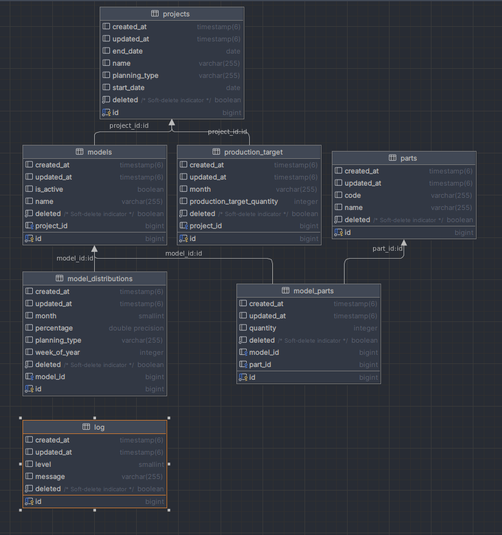
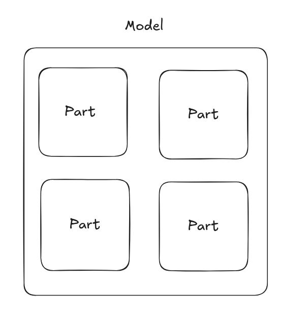
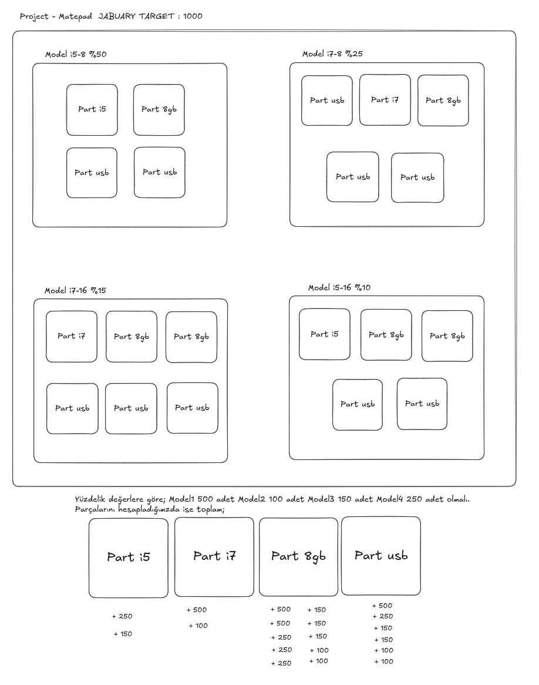
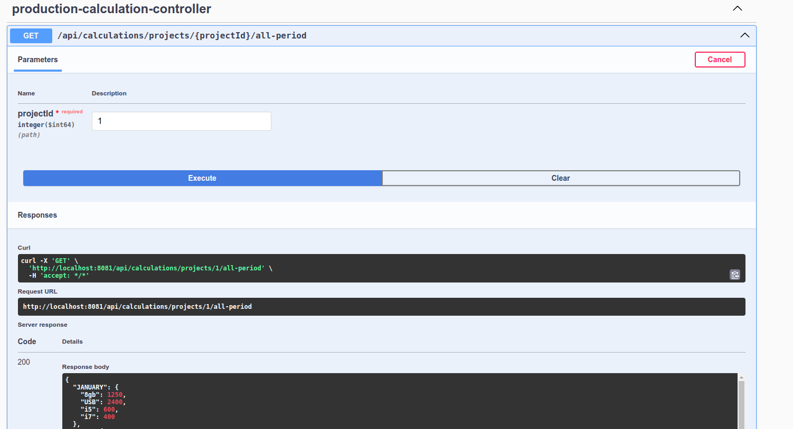

# Production Planning Application

This is a Production Planning application built with Spring Boot, designed to help manage and optimize production processes. The application provides a robust backend system with RESTful APIs and database integration.

## Technical Stack
- Java Version: 17
- Framework: Spring Boot 3.3.7
- Database: PostgreSQL
- Documentation: OpenAPI (Swagger UI)
- Build Tool: Maven
- Containerization: Docker & Docker Compose

## Key Features
- RESTful API endpoints for production planning
- Database persistence with PostgreSQL
- Swagger UI for API documentation
- Docker containerization for easy deployment
- Excel file processing capabilities (Apache POI)
- Input validation
- JPA for database operations
- Strategy Design Pattern
- Global Exception Handler
- Soft Delete with Hibernate

## Prerequisites
- Java 17 or higher
- Docker and Docker Compose
- Maven (or use included Maven wrapper)

## Installation and Setup
- Clone the repository: bash git clone https://github.com/sedaozcicek/huawei-challenge.git
- Build the application: bash ./mvnw clean install
- Run with Docker Compose: bash docker compose up

## Application Access
### Application URL
- **Base URL:** [http://localhost:8081](http://localhost:8081)
- **Swagger UI:** [http://localhost:8081/swagger-ui.html](http://localhost:8081/swagger-ui.html)
### Database Configuration
- **Port:** `5432`
- **Database Name:** `postgres`
- **Username:** `postgres`

## Project Structure
- src/main/java - Source code
- src/test - Test files
- docker-compose.yml - Docker composition configuration
- Dockerfile - Docker build configuration
- migration.sql - Database migration scripts

# Model Diagram

# Proje Yapısı ve Üretim Süreçleri
Bir projenin aylık üretim hedefi doğrultusunda üretilmesi planlanan modeller bulunmaktadır. Her model birden fazla parçadan oluşmakta, aynı zamanda bir parça birden fazla modelde yer alabilmektedir. Bu **çoktan çoğa (M:M)** ilişki nedeniyle, bu ilişkiyi temsil etmek amacıyla **model_parts** adlı ara tablo oluşturulmuştur.

**model_parts** tablosu, her modelin hangi parçalardan kaç adet içerdiğine ilişkin bilgileri barındırmaktadır. Ayrıca, her model mutlaka bir projeye bağlı olmalı, dolayısıyla projeler ile modeller arasında bire çok (1:N) bir ilişki bulunmaktadır. Bir proje, birden fazla model içerebilir.

Her modelin üç farklı üretim planlama yöntemi bulunmaktadır: **aylık, haftalık ve sabit**. Üretim planlamasına ilişkin detaylar **model_distribution** modelinde tutulmaktadır. Bu model, bağlı olduğu üretim planına göre modellerin üretim yüzdelerini belirlemektedir. Aylık veya haftalık üretimle yönetilen projelerde, modellerin üretim oranları farklı aylar veya haftalar arasında değişiklik gösterebilmektedir.Son olarak, bir projenin toplam aylık üretim hedefleri **production_target** modelinde kayıt altına alınmaktadır.

Yukarıda örnek bir model yapısı verilmiştir.

# Proje ve Üretim Sürecine İlişkin Özellikler
### 1. Proje Oluşturma ve Üretim Planı Belirleme
- **Projeler oluşturulurken**, üretim planlama türü `MONTHLY`, `WEEKLY` veya `FIXED` olarak konfigüre edilebilir.
- **API Endpoint:** `/api/projects/create/{planningType}`

---

### 2. Model ve Parça Yönetimi
- Projeye kullanılacak **modeller** ve **parçalar** eklenebilir.
- **Model distribution** ve **model part** verileri silinebilir veya güncellenebilir.
- Parçalar ve modeller arasındaki ilişki yönetilirken kullanıcı, her bir model için gerekli parça sayısını belirtebilir:
    - **API - Create:** `/api/model-parts (POST)`
    - **API - Update:** `/api/model-parts/{id}/update-model-part`

---

### 3. Toplam Üretim Miktarının Hesaplanması
- Üretim miktarı `MONTHLY`, `WEEKLY` ve `FIXED` planlama türlerine göre hesaplanır.
- Hesaplamalar, **Strategy Design Pattern** kullanılarak gerçekleştirilmiştir.
- **FIXED planlama türünde**, yalnızca **aktif modeller** hesaba katılır, pasif modeller hariç tutulur.
- **API Endpoint:** `/api/calculations/projects/{projectId}/all-period`

---

### 4. Üretim Planlama Türüne Göre Model Durumu
- Projenin üretim planı `WEEKLY` veya `MONTHLY` ise **modeller pasif hale getirilemez**.
- **API Endpoint:** `/api/projects/{projectId}/planning-type`

---

### 5. Model Distribution Yönetimi
- **Model distribution** modeli, farklı ay veya haftalardaki yüzdelik değişim oranlarını yönetir.
- Belirli bir ay veya haftaya ait yüzdelik oran mevcut değilse, hesaplamalar **FIXED** değerler üzerinden yapılır.

---

### 6. Modellerin Yüzdeliğe Göre Sıralanması
- Projede bulunan modeller:
    - **MONTHLY** ve **WEEKLY** planlama türlerinde, bulunduğu ay veya haftaya göre yüzdeliği en yüksekten en düşüğe sıralanır.
    - **FIXED** planlama türünde, yüzdeliği büyükten küçüğe sıralanır.
- **API Endpoint:** `/api/projects/{projectId}/sort-by-percentile`

---

### 7. Proje Ayarlarının Güncellenmesi
- Kullanıcılar, proje ayarlarını istedikleri zaman güncelleyebilir.
- Üretim planlama türüne bağlı olarak hesaplamalar:
    - Haftalık yüzdelik oran mevcutsa bu oran üzerinden yapılır.
    - Yüzdelik oran mevcut değilse **FIXED** değerler üzerinden yapılır.
- **API Endpoints:**
    - Planlama türü güncelleme: `/api/projects/{projectId}/planning-type`
    - Hesaplama: `/api/calculations/projects/{projectId}/all-period`

---

### 8. Soft Delete Özelliği
- **BaseEntity** üzerinden Hibernate'in anotasyonları kullanılarak **Soft Delete** uygulanmıştır.
- Bağımlı tablolar da aynı şekilde soft delete yöntemiyle silinir.

---

### 9. Global Exception Handling
- Proje genelinde hataların yönetimi için bir **Global Exception Handling** mekanizması uygulanmıştır.

---

### 10. Haftalık Hesaplama
- Haftalık üretim miktarı, belgelendirmede aksi belirtilmediği için aylık üretim hedefinin **1/4'ü** olarak hesaplanır.
- Bu yöntem, olası veri kayıplarının gerçekleşebileceği göz önünde bulundurularak geliştirilebilir bir alandır.

---

### 11. Log Takibi
- **Model** ve **parça işlemlerine** ilişkin tüm loglar veritabanına kaydedilmiştir.
- Loglar üzerinde aşağıdaki kriterlere göre arama yapılabilmektedir:
    - **İçerisinde gelen kelime ile arama**
    - **Tarih aralığında arama**
    - **Log seviyesine göre arama**
- Yapılan aramalar, belirtilen kriterlerin **"OR"** ile bağlanması yoluyla gerçekleştirilmiştir.
- Ancak, belirli bir tarih aralığında belirli bir isim için arama yapılması özelliği bulunmamaktadır. Bu durum, sistemin geliştirilebilecek bir yönü olarak öne çıkmaktadır.
- Loglama altyapısının daha verimli bir şekilde yönetilebilmesi için **Elasticsearch** kullanımı önerilmektedir.

---

# Database Görselleştirmesi

#### Proje Bilgileri
- **Proje Adı:** HuaweiMatePad
- **Planning Type:** MONTHLY
- **Üretim Hedefi (Ocak):** 1000 adet

---

#### Modeller
1. **Model 1:** MatePad-i5-8gb
2. **Model 2:** MatePad-i5-16gb
3. **Model 3:** MatePad-i7-16gb
4. **Model 4:** MatePad-i7-8gb

---

#### Parçalar
1. **Parça 1:** i5
2. **Parça 2:** i7
3. **Parça 3:** 8gb
4. **Parça 4:** USB

---

#### Model-Parça İlişkileri ve Miktarlar
| Model          | Parça         | Miktar |
|----------------|---------------|--------|
| **Model 1**    | Part 1 (i5)   | 1      |
|                | Part 3 (8gb)  | 1      |
|                | Part 4 (USB)  | 2      |
| **Model 2**    | Part 1 (i5)   | 1      |
|                | Part 3 (8gb)  | 2      |
|                | Part 4 (USB)  | 2      |
| **Model 3**    | Part 2 (i7)   | 1      |
|                | Part 3 (8gb)  | 2      |
|                | Part 4 (USB)  | 3      |
| **Model 4**    | Part 2 (i7)   | 1      |
|                | Part 3 (8gb)  | 1      |
|                | Part 4 (USB)  | 3      |

---

#### Model Dağılımları
| Model          | Dağılım (%) |
|----------------|-------------|
| **Model 1**    | 50%         |
| **Model 2**    | 10%         |
| **Model 3**    | 25%         |
| **Model 4**    | 15%         |

---

### Amaç
Ocak ayında **1000 adet model** üretilebilmesi için gerekli olan parçaların miktarlarını belirlemek:
- **i5**
- **i7**
- **8gb**
- **USB**

Yukarıdaki hesaplamalara göre monthly olan projenin sistemde hesaplanması sonucu şu şekildedir. Sistemin doğruluğu bu şekilde kanıtlanmıştır.

3 type a göre model üretimi hesaplama projesidir.

